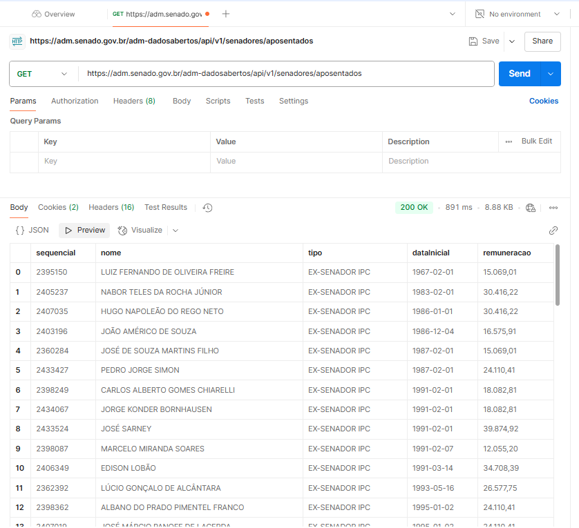

# API de Senadores - Projeto Programação Web em PHP

## Integrantes do Grupo
- Aisha Gabriele Ramiro  
- Bruna Scaramuzza Rodrigues  
- Lucas Alves de Freitas

**API de Dados Abertos do Senado Federal**  
Documentação oficial: [https://dadosabertos.senado.leg.br/](https://dadosabertos.senado.leg.br/)

## Descrição do Projeto
Este projeto consiste em consumir dados públicos da API do Senado Federal utilizando PHP. 
O sistema permite ao usuário buscar informações sobre senadores, visualizar dados retornados e exibi-los na interface.

Foram utilizados recursos como:
- Requisição com `cURL`
- Decodificação de dados JSON
- Integração entre `index.php` e `resultados.php`
- Estilização básica com HTML e CSS

## Estrutura
- `index.php`: Formulário de pesquisa onde o usuário digitará o ano de consulta.
- `resultados.php`: Realiza a requisição à API e exibe os dados processados.

## Requisição no Postman


## Como Executar
1. Faça o clone ou download do repositório:
   ```bash
   git clone https://github.com/aisha-ramiro/programacaoweb_api.git
2. Coloque os arquivos em um servidor local (ex: XAMPP ou WAMP).
3. Acesse o link local no navegador.
4. Preencha o formulário e clique em Enviar.
5. Os dados serão exibidos com base na resposta da API.
